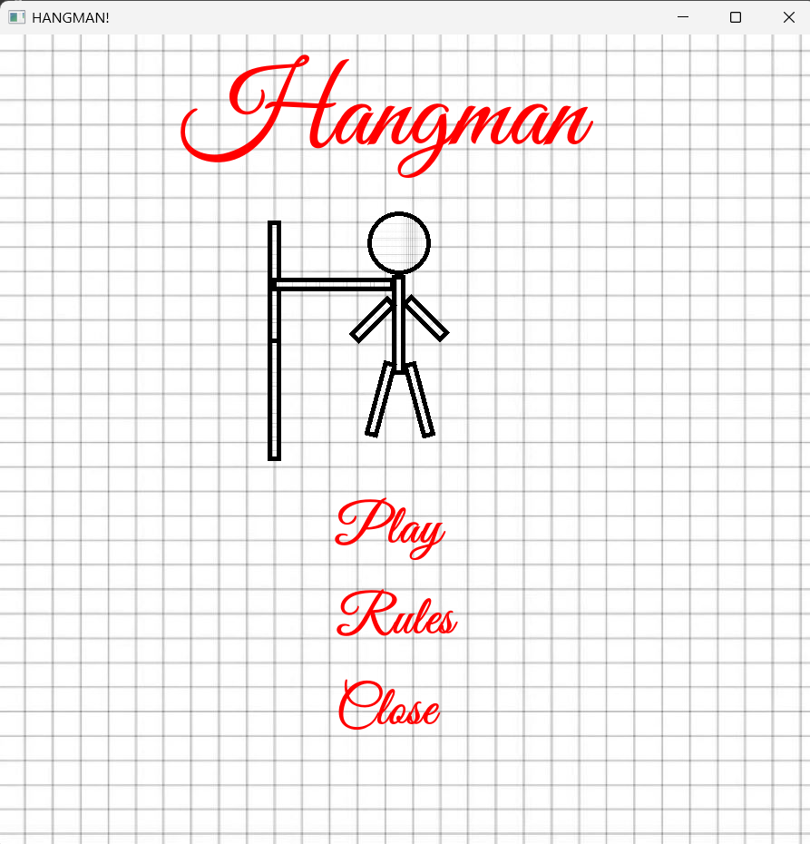
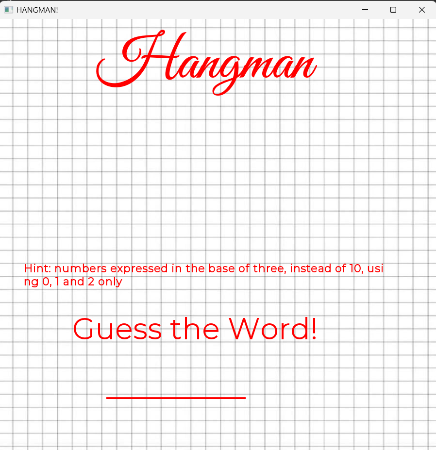
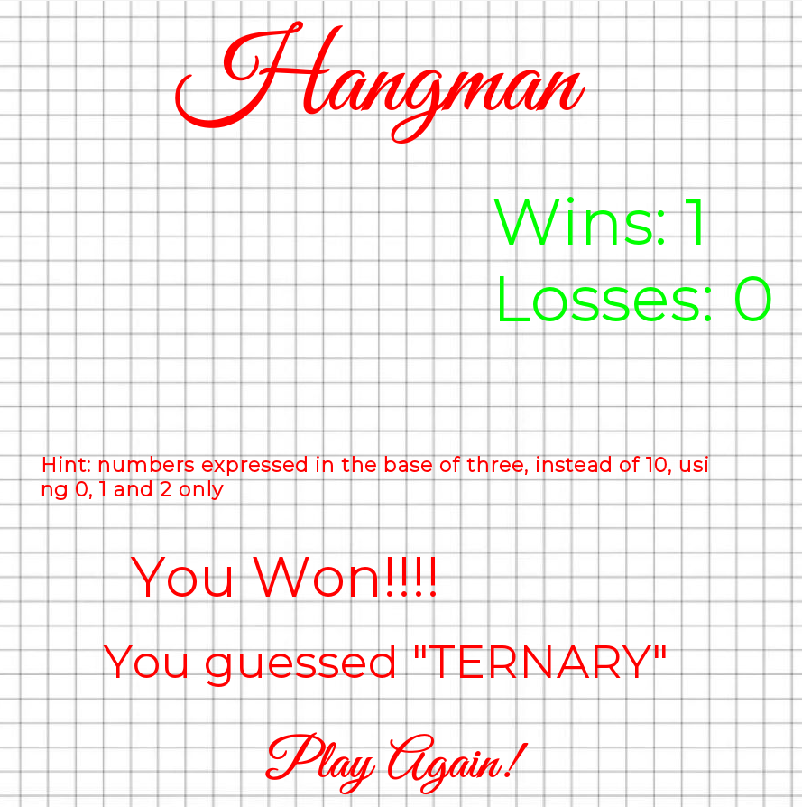
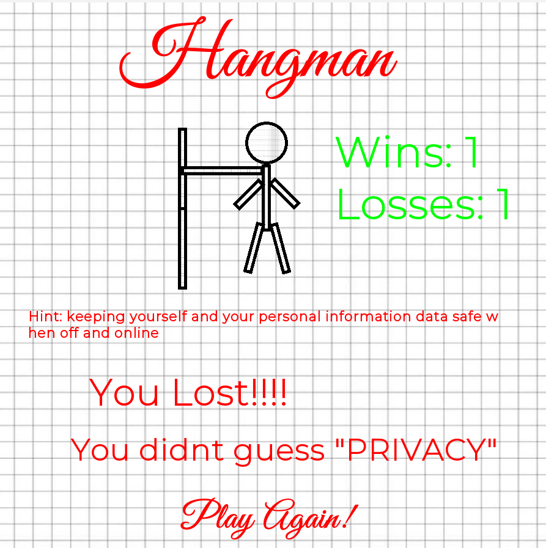
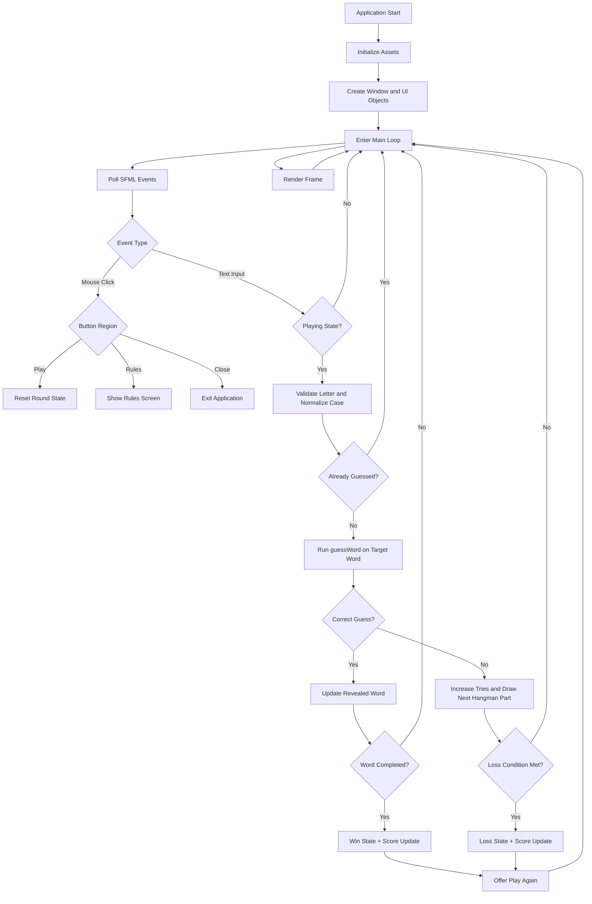

# Hangman Game

A polished, audio-visual Hangman experience built with C++ and SFML.

This project combines core gameplay logic with a clean desktop UI, contextual hints, progressive difficulty feedback, and event-driven architecture. It is designed as both a playable game and a strong portfolio-quality reference for object-oriented C++ application development.

## Visual Preview

### Main Menu

### Gameplay Screen

### Win State

### Loss State

## Why This Project Stands Out

- Professional desktop game flow with clear state transitions (Menu, Rules, Gameplay, End-state)
- Real-time rendering and interaction using SFML graphics and event system
- Strong gameplay loop with validated input, duplicate-guess protection, and result feedback
- Rich user experience with typography, background graphics, and multi-sound feedback
- Codebase demonstrates practical OOP, string processing, state management, and UI coordination

## Live Project Scope

This repository currently includes:

- Core C++ source implementation
- SFML-based graphics and audio integration
- Project assets: fonts, images, and sound files
- Viva preparation materials for presentation readiness

Primary source:
- Hangman-trial.cpp

## Gameplay Overview

1. A random word and matching hint are selected.
2. The word is hidden with underscores.
3. The player types letter guesses.
4. Correct letters reveal at all matching positions.
5. Incorrect guesses build hangman parts progressively.
6. The round ends with win/loss messaging and score update.
7. User can replay without restarting the application.

## Technical Architecture

### Core Classes

#### Game
Shared game-level mechanics:
- Wrong attempt tracking (tries)
- Max-attempt policy
- Session score counters (wins and losses)
- Loss condition evaluation

#### Hangman
Domain-specific mechanics:
- Target word storage
- Revealed-progress storage
- Hint association
- Letter matching and reveal logic
- Win condition evaluation

### Interaction Model

- Event-driven keyboard and mouse handling via SFML
- Input validation pipeline for alphabetic character acceptance
- Case normalization for consistent matching
- Duplicate-guess guard using indexed lookup strategy

## Architecture Flow Diagram

### What This Architecture Contains

- Application lifecycle: startup, initialization, and continuous render loop
- Input channels: mouse events for menu controls and text events for letter guesses
- Gameplay decision gates: playing state check, duplicate-guess check, correctness check
- Core domain operations: word reveal updates, try counting, win/loss evaluation
- UI feedback outputs: text updates, hangman progression, and replay prompt
- End-state transitions: win/loss screens with score updates and replay path

## How Letter Position Recognition Works

When a player types a character, the system performs:

1. Text event capture
2. ASCII + alphabetic validation
3. Uppercase normalization
4. Duplicate check using index mapping:
   - index = uppercaseLetter - 'A'
5. Full scan of the hidden answer string
6. Positional reveal in guessed string where matches occur
7. Immediate UI refresh with updated guessed state

This guarantees that repeated letters in a word are revealed correctly across all valid positions.

## Feature Breakdown

### Core Gameplay
- Randomized word/hint pairing
- Underscore-based hidden-word initialization
- Correct/incorrect guess branching
- Win/loss state transitions
- Replay support

### User Interface
- Menu actions: Play, Rules, Close
- Dynamic hint display
- Dynamic guessed-word rendering
- Game status messaging
- Scoreboard rendering (wins/losses)

### Visual Progression
- Incremental hangman drawing tied to wrong-guess count
- Shape-based rendering using SFML primitives

### Audio Design
- Intro/background cue behavior
- Correct input sound effect
- Wrong input sound effect
- Exit/transition audio feedback

## Technology Stack

- Language: C++
- Framework: SFML (Graphics + Audio)
- Runtime Style: Event-driven desktop application

## Libraries and Their Role

### iostream
Used for debug output and runtime trace messaging.

### string
Used for target word storage, hint text management, and dynamic reveal transformations.

### SFML/Graphics.hpp
Used for:
- Window creation and frame lifecycle
- Text rendering
- Sprite/texture background rendering
- Shape rendering for hangman components
- Event handling integration

### SFML/Audio.hpp
Used for:
- Audio file buffering
- Sound playback and transition cues

### stdlib.h, ctime, time.h
Used for pseudo-random round initialization.

### cctype
Used for robust character validation and normalization.

## Open-Source Readiness

This project is prepared to be understood and extended by contributors. The codebase is structured around clear gameplay behavior and visible UI outcomes, making onboarding straightforward for students, beginners, and intermediate developers.

### Recommended Contribution Areas

- Refactor state management into explicit finite-state enums
- Improve text wrapping for variable hint lengths
- Add external dictionary file support for larger word sets
- Introduce unit tests for core Hangman logic
- Add cross-platform build instructions via CMake
- Add difficulty levels and category-based word packs

## Build and Run

### Prerequisites

- C++ compiler with modern C++ support
- SFML installed and linked (matching your compiler/toolchain)

### Steps

1. Compile Hangman-trial.cpp with SFML Graphics and Audio modules.
2. Ensure these folders are available beside the executable:
   - Audio/
   - Fonts/
   - images/
3. Launch executable.

## Controls

- Mouse:
  - Play
  - Rules
  - Close
- Keyboard:
  - Letter keys A-Z for guessing

## Project Assets

- Background textures in images/
- Sound effects and music in Audio/
- Typography assets in Fonts/

## Quality Notes

- Input is validated to reduce accidental invalid interactions.
- Duplicate guesses are guarded to preserve fair gameplay flow.
- Word and hint pair remain synchronized through shared random index selection.
- Gameplay remains responsive through continuous event polling and frame rendering.

## Roadmap

- Add CMake build support
- Add CI pipeline for build verification
- Add modular game-state controller
- Add optional keyboard shortcuts for menu navigation
- Add richer result analytics per session

## Acknowledgment

Built as a focused C++ + SFML project demonstrating practical game-loop engineering, object-oriented design, and user-facing interaction quality in a desktop environment.
